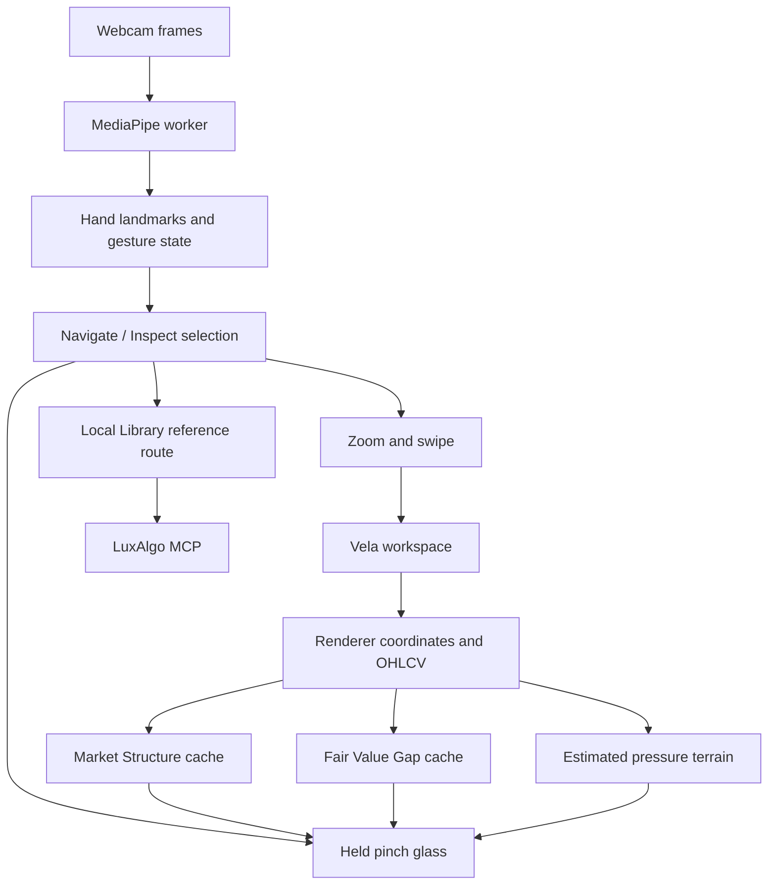

# Architecture

Aperture has a browser application and a narrow local server bridge. Video processing, chart controls and analysis are independent of the Library connection.

## Files and responsibilities

| Area | Files | Responsibility |
| --- | --- | --- |
| Application | `src/main.ts`, `src/style.css` | Vela workspace, providers, monochrome UI and lifecycle |
| Toolbar | `src/vision-trigger.ts`, `src/vision.svg` | Version-scoped Vision button adapter |
| Camera worker | `public/vision-worker.js`, `scripts/vision-assets.mjs` | Pinned local assets, GPU/CPU inference, worker messages |
| Controller | `src/vision-controller.ts` | Camera permissions, worker lifecycle, menu DOM, viewport updates, preview annotations |
| Gesture state | `src/vision-gestures.ts` | Pinch recognition, smoothing, hand identity, fist/palm/swipe classification, zoom/pan |
| Menus | `src/vision-modes.ts`, `src/inspect-concepts.ts` | 1.5-second palm hold, vertical selection, fresh-tap submenu, curated concept names |
| Field geometry | `src/vision-frames.ts`, `src/vision-field-geometry.ts`, `src/vision-depth.ts` | Pinch lifetime, rotation, clipping and approximate perspective |
| Chart bridge | `src/vision-geometry.ts` | Public Vela renderer layer; candle/level/zone projection |
| Calculations | `src/market-structure.ts`, `src/fair-value-gaps.ts` | Closed-bar detectors and history-aware caches |
| Visual effects | `src/vision-energy.ts` | Glass surface, candle/edge connections, sparks, structure and gap drawing |
| Pressure | `src/vision-pressure*.ts` | OHLCV estimate, fixed-grid interpolation, contours and floating panel |
| Library | `server/luxalgo-library.mjs`, `scripts/library.mjs`, `vite.config.mjs` | MCP SDK client, local HTTP bridge and CLI |
| Regression tests | `tests/*.test.mjs` | Gesture state, geometry, closed-bar calculations and connector boundaries |

## Tracking lifecycle

Vision is opt-in. Starting creates a dedicated worker and obtains a video stream; the microphone is never requested. Frames are transferred as image bitmaps, closed after inference, and processed one at a time. GPU initialization falls back to CPU when needed. The main thread receives landmarks, hand identities and a timestamp.

The controller rejects old results, stale frames and ambiguous duplicate hand identities. Frame sampling and the bounded effects budget avoid queuing unbounded work. Stop, tab hiding and module disposal terminate the worker, stop media tracks, cancel animation and remove active field state.

## Interaction state

Navigate is selected at each camera start. An open-palm dwell requires exactly one active hand. A visible fist counts as inactive. Chart gestures pause while a menu opens or is being used.

The mode menu and concept menu share vertical movement and thumb–index tap logic. Selecting Inspect changes the menu stage, not the active mode immediately. A held selection pinch cannot also select the concept: fingers must reopen before a fresh tap. Cancellation preserves the previously active mode and concept. Mouse and keyboard use the same selection state.

## Coordinate spaces

MediaPipe coordinates are mirrored for the preview and pointers. Field shape is calculated in chart pixels so non-square charts preserve geometry. Vela supplies the active plot's dimensions, time projection and price scale through its public renderer layer.

The inspection window moves over chart-anchored data. Rotating the window does not rotate candle prices, BOS/CHOCH levels or FVG zones. The polygon clips the effects. Approximate depth comes from changes in each palm's projected scale relative to its own grab baseline, not from comparing two hand-local world-z coordinates.

## Analysis and performance

Structure and gap caches recompute on closed-history changes, including in-place corrections. They do not recompute for every hand movement. The most recent possibly forming bar is excluded from both detectors. Pressure may include the latest bar and marks it as live.

The energy effect uses at most 72 candle anchors, 140 sparks, a one-million-pixel bitmap, roughly 30 FPS, 48 structure lines and 32 gap zones. Gap calculation retains the latest 240 zones. Pressure uses every covered candle independently of decorative sampling, a 96×40 surface, and about six recalculations per second. Reduced-motion mode suppresses animation.

## Serving

`pnpm dev` and `pnpm preview` mount `GET /api/library/inspect`. The browser receives only validated reference metadata. The MCP SDK remains server-side; it is not part of the browser bundle. Static hosting still supports local calculations but has no live reference bridge.

No deployment, authentication service, database or brokerage integration is included. See [MCP.md](MCP.md) before extending the server boundary.
